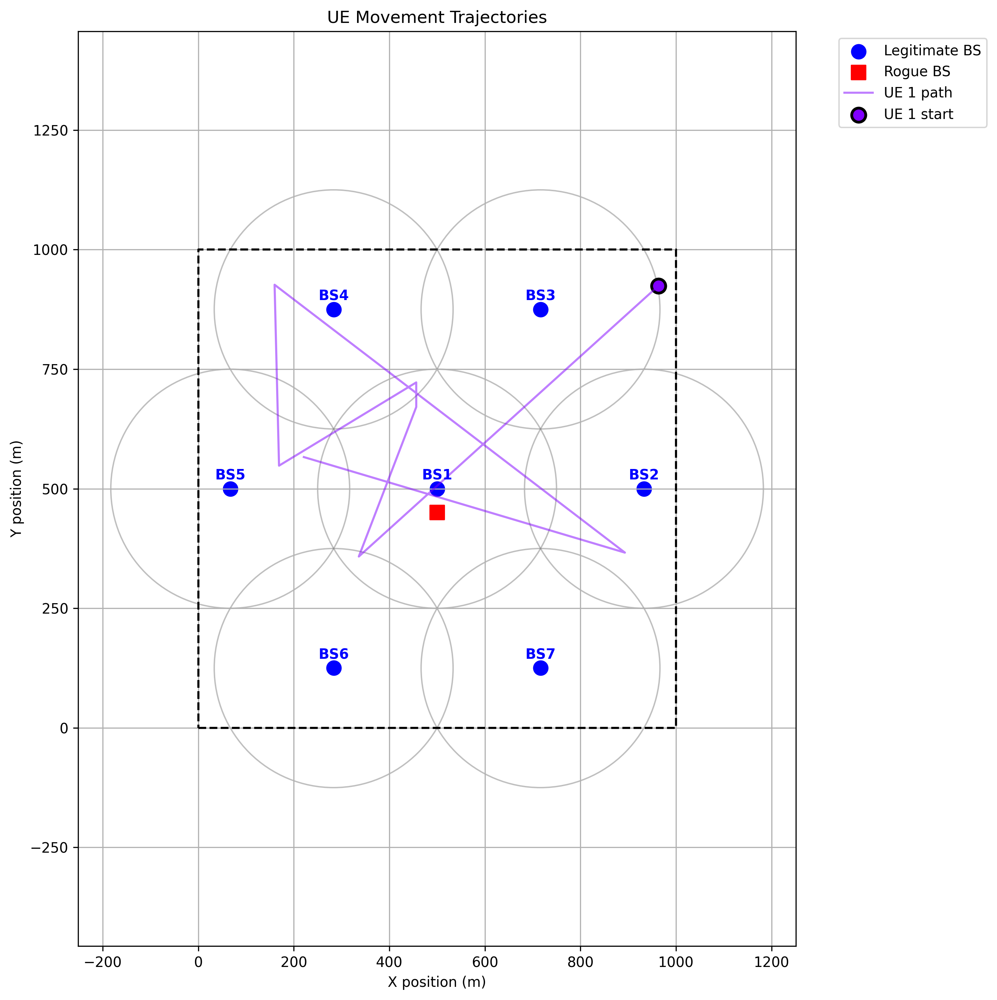
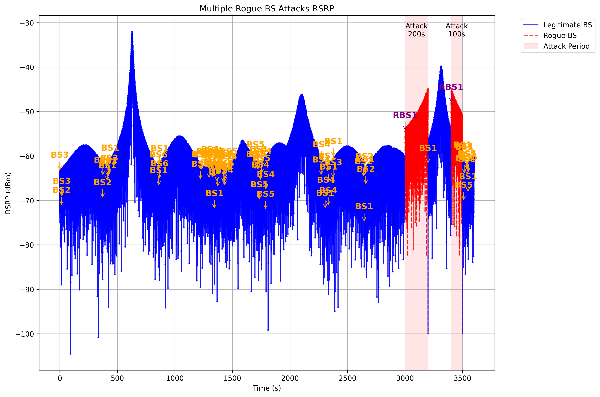

# Simulation of the Signal Strength of 5G Rogue Base Stations

This project simulates and analyzes the signal strength patterns of rogue base stations in 5G networks. The simulation focuses on detecting security threats posed by malicious base stations through accurate RF signal strength modeling, movement trajectory analysis, and visualization tools. The project is implemented in Python and provides a comprehensive framework for studying signal propagation and detection processes in a 5G environment.

## Features

- **Signal Strength Calculation**: Accurately models RF signal strength between base stations and user equipment (UE) in a 5G environment.
- **Rogue Base Station Detection**: Identifies potential rogue base station attacks by analyzing signal strength patterns and anomalies.
- **Movement Trajectory Analysis**: Simulates and visualizes the movement patterns of user equipment and its interaction with base stations.
- **Hexagonal Grid System**: Implements a realistic 5G cellular network topology using a hexagonal grid structure.
- **RSRP Analysis**: Calculates and visualizes Reference Signal Received Power (RSRP) measurements from multiple base stations.

## Directory Structure

- **scenario/**: Contains core simulation components
  - `hex_grid.py`: Implements the hexagonal grid system for cellular network topology.
  - `signal_calculation.py`: Includes algorithms for signal strength calculation.
  - `ue_movement.py`: Simulates the movement of user equipment.

- **visualization/**: Provides tools for visualizing simulation results
  - `rogue_bs_signal_plot.py`: Visualizes signal strength patterns from rogue base stations.
  - `trajectory_plot.py`: Provides visualization tools for tracking movement trajectories.

- **result/**: Stores output files and analysis results
  - Generated visualizations (PNG format)
  - Dataset files (CSV format)
  - RSRP measurements and results
  - Movement trajectory plots

- **config.py**: Contains configuration settings for simulation parameters.
- **main.py**: Integrates all simulation components and serves as the entry point for the simulation.

## How to Run

Run the simulation using the following command:

```bash
python main.py
```

This will execute the full simulation, generate visualizations, and output results in the `result/` directory.

## Example Signal Strength Visualization

### Movement Trajectory of User Equipment



This plot shows the movement trajectory of user equipment (UE) within the simulation environment. The path of the UE is tracked over time as it interacts with various base stations. This visualization helps in understanding how UE movement affects the reception of signals from both legitimate and rogue base stations.

### Rogue Base Station Signal Strength



This image visualizes the signal strength (RSRP) patterns in the presence of multiple rogue base stations attacking a 5G network. The graph illustrates how the signal strength varies with distance from the base stations and highlights potential areas where malicious base stations might interfere with legitimate user equipment.

## Reference

- [Generation of realistic signal strength measurements for a 5G Rogue Base Station attack scenario](https://ieeexplore.ieee.org/document/9162275)
